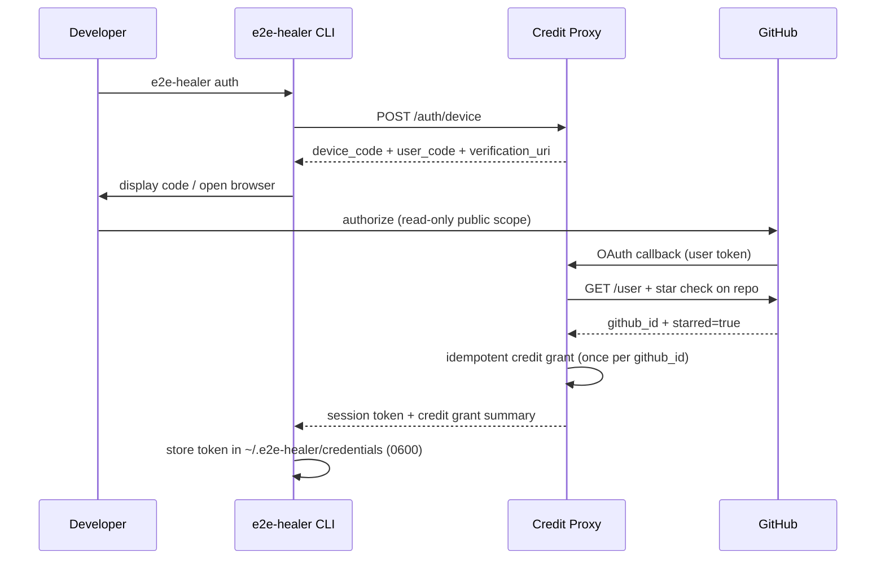
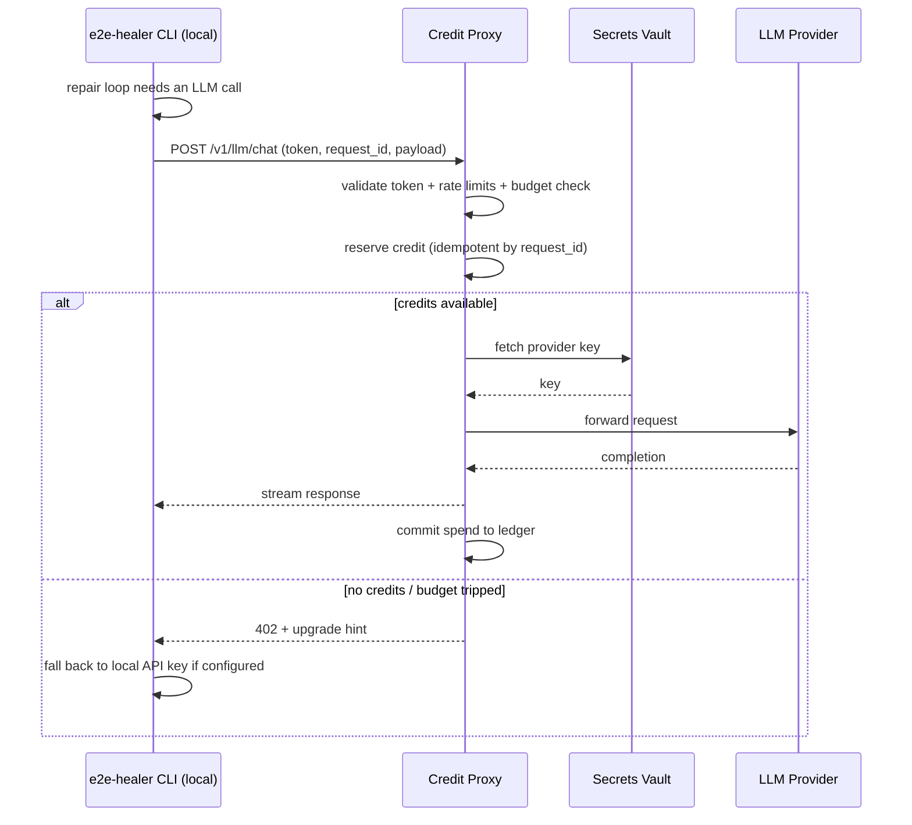

# RFC 0139: Free Token Event — GitHub-Star Credit Proxy Architecture

| Metadata | Details |
| :--- | :--- |
| **Issue** | [#139](https://github.com/Lee-Dongwook/E2E-Self-Heal/issues/139) |
| **Status** | Proposed |
| **Milestone** | v1.0 |
| **Component** | Hosted Credit Proxy (backend) + CLI auth surface |

---

## 1. Executive Summary
This RFC defines the architecture for a **first-party hosted credit proxy** that grants free LLM healing credits to users who star the `E2E-Self-Heal` repository. The proxy verifies stars, issues and accounts for credits, custodies provider API keys, and forwards LLM requests on behalf of authenticated users.

**Core Principle:** The proxy is a *thin hosted wrapper*. **No repair logic, LangGraph execution, or test-healing code lives in the backend.** The core engine remains fully locally runnable with a user's own keys.

---

## 2. High-Level Architecture

```text
┌──────────────────────────┐        ┌───────────────────────────────┐
│     Developer Machine    │        │   Hosted Credit Proxy (SaaS)  │
│                          │        │                               │
│  ┌────────────────────┐  │  HTTPS │  ┌─────────────────────────┐  │
│  │  e2e-healer CLI    │  │ ◄────► │  │ Auth Service            │  │
│  │  (core engine)     │  │        │  │ (GitHub OAuth + stars)  │  │
│  │                    │  │        │  ├─────────────────────────┤  │
│  │ - LangGraph loop   │  │        │  │ Accounting Service      │  │
│  │ - Playwright run   │  │        │  │ (credits ledger)        │  │
│  │ - Patch/verify     │  │        │  ├─────────────────────────┤  │
│  │ - NO keys stored   │  │        │  │ LLM Proxy               │  │
│  └────────────────────┘  │        │  │ (vault + forwarding)    │  │
│                          │        │  └───────────┬─────────────┘  │
│  ┌────────────────────┐  │        │  ┌───────────▼─────────────┐  │
│  │ Playground (Web)   │  │ ◄────► │  │ Abuse Controls          │  │
│  │ (future surface)   │  │        │  │ (rate limits, budgets)  │  │
│  └────────────────────┘  │        │  └─────────────────────────┘  │
└──────────────────────────┘        └───────────────┬───────────────┘
                                                    │ vault-only keys
                                                    ▼
                                    ┌───────────────────────────────┐
                                    │  LLM Providers                │
                                    │  (NVIDIA / OpenAI / Anthropic)│
                                    └───────────────────────────────┘
```

---

## 3. Star Verification (Authentication)

### 3.1 Flow (GitHub OAuth Device Flow)



### 3.2 Anti-Gaming

- Star check performed **server-side** with the backend's own token.
- Star status cached with a 24h TTL to block rapid unstar/re-star cycles.
- Credits granted **once per** **`github_id`** (unique constraint), not per username.

---

## 4. Credit Issuance & Accounting

### 4.1 Data Model (Append-Only Ledger)

```text
users                 credits_ledger                llm_usage
┌──────────────┐      ┌────────────────────────┐    ┌────────────────────┐
│ github_id PK │      │ entry_id PK (uuid)     │    │ request_id PK      │
│ username     │      │ github_id FK           │    │ github_id FK       │
│ created_at   │      │ event (grant | spend)  │    │ provider           │
└──────────────┘      │ amount                 │    │ tokens_in / out    │
                      │ tier (star|sponsor)    │    │ cost_usd           │
                      │ granted_at/expires_at  │    │ created_at         │
                      │ request_id (UNIQUE)    │    └────────────────────┘
                      └────────────────────────┘
```

### 4.2 Consumption Rules

- **1 heal run = 1 credit** (regardless of internal loop count).
- Consumption is **idempotent**, keyed by client-generated `request_id`.
- Credits expire 30 days after grant.
- Exhausted credits → CLI prints a friendly prompt to configure a personal API key.

### 4.3 Heal Request Flow



---

## 5. Provider Key Custody

- Keys stored only in a secrets vault.
- CLI never receives provider keys.
- Zero-downtime rotation supported.

---

## 6. Abuse Prevention

| Threat | Mitigation |
| :--- | :--- |
| Multi-account farming | OAuth + one grant per github_id + IP limits |
| Unstar after claim | Credits expire in 30 days |
| Oversized payloads | Reject >50KB |
| DDoS / scraping | Per-user rate limits |
| Token theft | 1-hour session tokens |
| Runaway spend | Global budget breaker |

---

## 7. CLI & Playground Touchpoints

### New CLI Commands

| Command | Purpose |
| :--- | :--- |
| `e2e-healer auth` | OAuth flow + credit grant |
| `e2e-healer credits` | Show balance |

### Settings

| Setting | Default | Description |
| :--- | :--- | :--- |
| `E2E_HEALER_PROXY_URL` | `""` | Proxy URL |
| `E2E_HEALER_PROXY_TOKEN` | `""` | Session token |

---

## 8. Core ↔ Backend Boundary

| Responsibility | CLI | Proxy |
| :--- | :---: | :---: |
| LangGraph repair loop | ✅ | ❌ |
| Playwright execution | ✅ | ❌ |
| OAuth + star verification | ❌ | ✅ |
| Credit ledger | ❌ | ✅ |
| Provider key custody | ❌ | ✅ |

**Guarantees**

- Backend never executes repair logic.
- CLI remains fully local with user keys.

---

## 9. Open Questions

1. Provider-agnostic credits?
2. Streaming in v1?
3. Proxy outage fallback?
4. Extra contributor credits?

---

## 10. Acceptance Criteria Checklist

- [x] Auth covered
- [x] Accounting covered
- [x] Abuse controls covered
- [x] Core/backend boundary defined
- [x] No repair logic in backend
- [x] Core stays locally runnable
