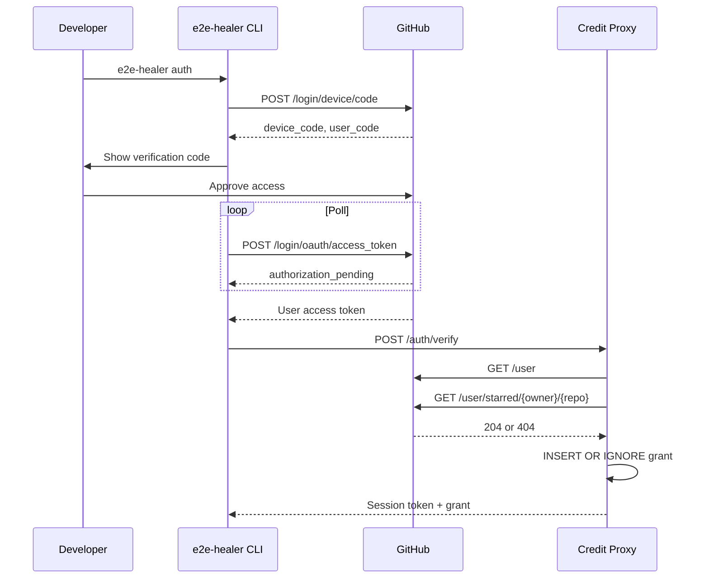

# RFC 0139: Free Token Event — GitHub-Star Credit Proxy Architecture

| Metadata | Details |
| :--- | :--- |
| **Issue** | https://github.com/Lee-Dongwook/E2E-Self-Heal/issues/139 |
| **Status** | Proposed (rev 2 — review feedback addressed) |
| **Milestone** | v1.0 |
| **Component** | Hosted Credit Proxy (backend) + CLI auth surface |

---

## 1. Executive Summary

This RFC defines a **first-party hosted credit proxy** that grants free LLM healing credits to users who star the `E2E-Self-Heal` repository. The proxy verifies stars, issues and accounts for credits, custodies **hosted** provider keys, and forwards LLM requests for authenticated users.

**Key-custody scope (important):**
*Proxy-managed* provider keys never leave the backend vault and are never sent to the CLI. *User-managed* keys (`E2E_HEALER_LLM_API_KEY` or provider-specific env vars) remain fully supported, stay on the user's machine, and are used directly by the CLI whenever the proxy is disabled, unreachable, or out of credits.

**Core Principle:** The proxy is a *thin hosted wrapper*. **No repair logic, LangGraph execution, or test-healing code lives in the backend.** The core engine remains fully locally runnable.

---

## 2. High-Level Architecture

```text
┌──────────────────────────┐        ┌───────────────────────────────┐
│     Developer Machine    │        │   Hosted Credit Proxy (SaaS)  │
│                          │        │                               │
│  ┌────────────────────┐  │ HTTPS  │  ┌─────────────────────────┐  │
│  │  e2e-healer CLI    │◄─┼──────► │  │ Auth Service            │  │
│  │  (core engine)     │  │        │  │ (device flow + stars)   │  │
│  │                    │  │        │  ├─────────────────────────┤  │
│  │ - LangGraph loop   │  │        │  │ Accounting Service      │  │
│  │ - Playwright run   │  │        │  │ (grants, ledger, resv.) │  │
│  │ - Patch/verify     │  │        │  ├─────────────────────────┤  │
│  │ - User keys stay   │  │        │  │ LLM Proxy               │  │
│  │   local            │  │        │  │ (vault + forwarding)    │  │
│  └────────────────────┘  │        │  └───────────┬─────────────┘  │
│                          │        │              │                │
└──────────────────────────┘        └──────────────┼────────────────┘
                                                   │
                                                   ▼
                                    ┌───────────────────────────────┐
                                    │        LLM Providers          │
                                    │ OpenAI / Anthropic / NVIDIA   │
                                    └───────────────────────────────┘
```

---

## 3. Star Verification (Authentication)

### 3.1 GitHub Device Flow



Star verification uses the **user-authorized GitHub token**, which is discarded immediately after verification.

---

## 4. Credit Accounting

### Database Model

```text
users
grants
reservations
credits_ledger
llm_usage
```

### Rules

- One GitHub account receives one grant.
- Credits expire after **30 days**.
- FIFO grant consumption.
- `UNIQUE(github_id, request_id)` ensures idempotency.
- Payload hash mismatch returns **409 Conflict**.

### Reservation Lifecycle

```
reserved
    │
    ├── committed
    ├── released
    └── expired
```

TTL: **15 minutes**

Background reconciler:

- releases expired reservations
- completes crashed requests
- prevents duplicate provider charges

---

## 5. Provider Keys

Hosted keys:

- Stored only in Vault
- Never sent to CLI
- Rotated every 90 days

User keys:

- Stay on user machine
- Never uploaded
- Used automatically when proxy unavailable

---

## 6. Abuse Prevention

| Threat | Mitigation |
|--------|------------|
| Multi-account farming | One grant per GitHub account |
| Replay | request_id + payload hash |
| DDoS | Rate limiting |
| Token theft | 1-hour sessions |
| Oversized payloads | 50 KB limit |
| Runaway spend | Budget circuit breaker |

---

## 7. Data Retention

Default:

- No payload logging
- Memory-only forwarding
- Metadata only

Optional debug mode:

- Encrypted storage
- Retained 7 days
- Automatically deleted

---

## 8. CLI

### Commands

```bash
e2e-healer auth
e2e-healer credits
```

Configuration:

```bash
E2E_HEALER_PROXY_URL
E2E_HEALER_PROXY_TOKEN
```

---

## 9. Responsibility Split

| Responsibility | CLI | Proxy |
|---------------|-----|-------|
| LangGraph | ✅ | ❌ |
| Playwright | ✅ | ❌ |
| User API Keys | ✅ | ❌ |
| GitHub Auth | ❌ | ✅ |
| Credit Ledger | ❌ | ✅ |
| Hosted Keys | ❌ | ✅ |

---

## 10. Open Questions

1. Provider-agnostic credits?
2. Streaming support?
3. Contributor bonus credits?

---

## 11. Acceptance Criteria

- [x] Device Flow
- [x] Credit Accounting
- [x] Abuse Protection
- [x] Backend Boundary
- [x] Local-first Core

---